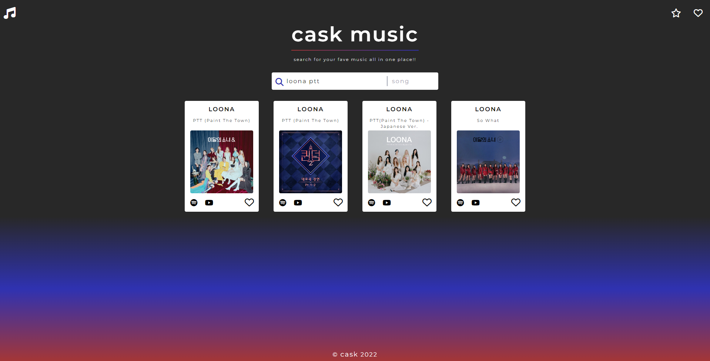
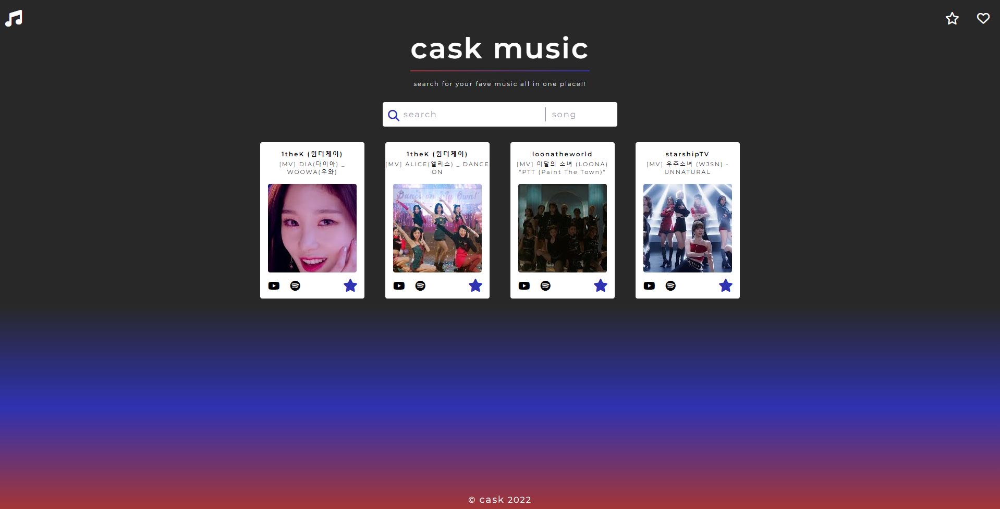

# cask music

## Description

Cask Music is a music & video search engine using Spotify & YouTube APIs.
This page helps the user search for their favourite music all in one
place without the hassle of jumping around different apps & webpages.
You can find your favourite songs by your favourite artist on Spotify
& also their music video or their latest performance in just one click!
Search by song & get the direct Spotify link as well as a direct search on
YouTube for each result. Search by video & get the direct YouTube link as
well as a direct search link of the user's input on Spotify. It also allows
the user to save their favourite songs & videos by hearting and starring them
for easy access.

Our motivation is to make looking for music simple on a light-weight page
with a clean, modern interface & user-friendly UI. We decided to build
Cask Music to help save time when looking for songs we like listening
to most & easily navigate between common streaming sites. It solves the
problem of every music-lover that hates going back & forth between
YouTube & Spotify. When looking at a YouTube video, you can easily find
the Spotify link to add to your playlist & vise-versa. We learned how to
effectively version control with multiple people working on the same
project, successful Git branching methods, agile methodology, & how to use
kanban to manage schedules & workloads.

## Screenshot

Here is a preview of the deployed website.

This picture depicts a user searching for a song.
Due to the small hard limit of the Spotify API, the top 4 results will show.
The top 4 results will also show for videos to keep it consistent.

This picture show how it looks like when you press 1 of the 2 nav bar icons.
It displays your favourite songs under heart & favourite videos under star.
This is a preview of favourite videos.

## Credits

- Spotify, Youtube, & Google 

- Spotify API by Glavier 

- Youtube v3 API by ytdlfree

- Carlo - https://github.com/C-Caballer0

- Addy - https://github.com/kirbyfridge

- Semir - https://github.com/seper56

- Kanhai - https://github.com/kanhairaval

## GitHub Repository

You can view our coding process at the link below.

https://github.com/kanhairaval/cask-music-new/

## GitHub Pages

You can view the functional webpage at the link below.

https://kanhairaval.github.io/cask-music-new/

## License

Please refer to the license in the repo.
